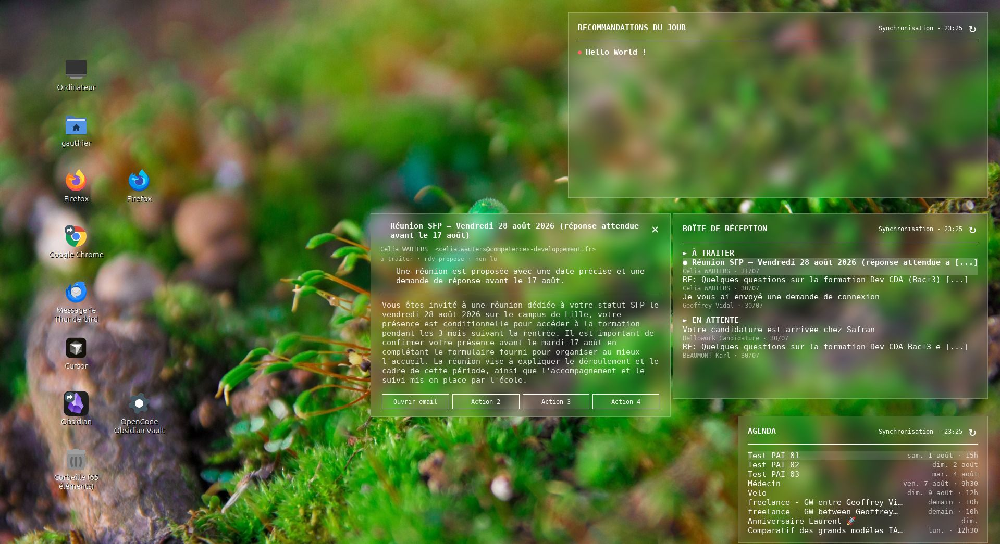

# P.A.I — Personal AI

Dashboard de bureau (Linux/X11, [eww](https://github.com/elkowar/eww)) qui affiche en un coup d'œil l'essentiel de ta journée : recommandations du jour, boîte mail triée et agenda — le tout dans une interface glassmorphique flottant sur le bureau, alimentée par des workflows [n8n](https://n8n.io).



## Fonctionnalités

- **Recommandations du jour** — panneau généré par une automatisation n8n (analyse IA des mails/agenda du jour).
- **Boîte de réception** — mails classés en sections *À traiter* / *En attente*, distinction lu/non lu et urgence, aperçu au survol et détail au clic (lien direct vers Gmail).
- **Agenda** — événements Google Agenda formatés en français (aujourd'hui/demain/jour de la semaine), aperçu au survol et détail au clic (lien direct vers Google Agenda).
- **Synchronisation** — bouton ↻ par panneau pour rafraîchir à la demande, plus rafraîchissement automatique en arrière-plan (mail : 5 min).
- **Multi-écran** — détection automatique portable seul / portable + écran externe, avec choix de l'écran cible.
- **Style glassmorphisme** — transparence et flou réels via `picom`, avec repli automatique si le compositeur GLX échoue.

## Architecture

Le point sensible du projet est l'affichage fiable des fenêtres d'aperçu au survol (voir `CHANGELOG.md` pour le détail des 11 itérations de debug). La logique retenue :

- `eww.yuck` / `eww.scss` — définition des widgets et du style.
- `fetch-digest.sh`, `fetch-events.sh`, `fetch-recos.sh` — récupèrent et normalisent les données depuis des webhooks n8n (auth via `~/.netrc`).
- `ui.sh` — point d'entrée des interactions (survol/clic), écrit dans un pipe nommé pour le survol, appelle `eww` directement pour les clics.
- `hoverd.sh` — démon persistant qui lit les événements de survol depuis ce pipe et les applique strictement dans l'ordre d'arrivée (évite toute course lors d'un survol rapide).
- `sync.sh` — resynchronisation manuelle d'un ou plusieurs panneaux.
- `start.sh` — lance le compositeur, le démon eww, le démon de survol, et ouvre les fenêtres sur le bon écran. Relançable à tout moment (ex: changement d'écran).

## Prérequis

- Linux avec serveur X11
- [eww](https://github.com/elkowar/eww) (compilé, attendu dans `~/.cargo/bin/eww`)
- `picom` (transparence/flou)
- `python3`, `curl`, `xrandr`
- Des workflows n8n exposant 3 webhooks (recommandations, mails, agenda) et des identifiants dans `~/.netrc` pour l'auth Basic

## Installation

```bash
git clone https://github.com/<ton-user>/P.A.I-Personal-AI.git ~/.config/eww
cd ~/.config/eww
```

Configure tes propres URLs de webhooks n8n dans `fetch-digest.sh`, `fetch-events.sh` et `fetch-recos.sh`, puis lance :

```bash
./start.sh
```

Relance simplement `start.sh` après un branchement/débranchement d'écran pour repositionner les fenêtres.

## Historique

`CHANGELOG.md` retrace en détail la session de debug ayant mené à l'architecture actuelle (démon FIFO anti-rafale, fenêtres pilotées par `revealer` plutôt que ouvertes/fermées à chaque survol).
